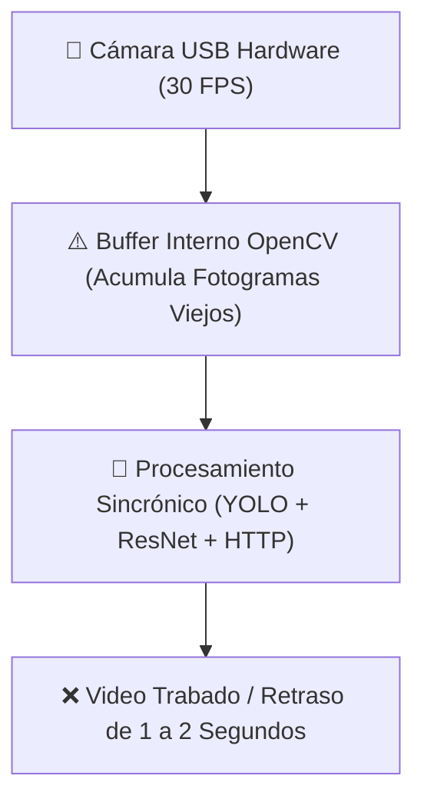
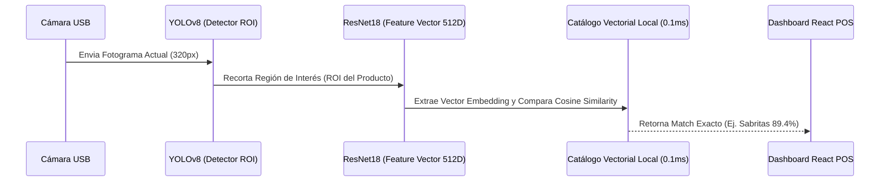

# 📄 Documentación Técnica: Diagnóstico de Rendimiento, Arquitectura de Cámara e Integración de GPU & Base Vectorial

---

## 🛠️ 1. Diagnóstico del Problema de Rendimiento de la Cámara en el Dashboard

El retraso o "tirones" (lag) en la previsualización del video al integrar visión por computadora en vivo (YOLOv8 + ResNet18) se debió a **tres factores de cuello de botella entrelazados**:



### A. Acumulación de Fotogramas en el Buffer de OpenCV (`cv2.VideoCapture`)
- **Comportamiento Estándar**: Cuando `cap.read()` se ejecuta de forma sincrónica en el mismo bucle que la IA, si el bucle tarda 50ms por iteración, la cámara sigue enviando fotogramas a 30 FPS al buffer interno de Windows (`DirectShow` / `Media Foundation`).
- **Efecto**: El buffer se llena con fotogramas "viejos", provocando que la previsualización tenga un retraso acumulativo de 1 a 2 segundos y se mueva a saltos.

### B. Latencia por Consulta a la Nube (Supabase Cloud RPC)
- **Comportamiento detectado**: Al no encontrar coincidencia local inmediata, el motor vectorial ejecutaba una petición HTTP sincrónica a Supabase (`buscar_producto_por_vector`) en cada fotograma.
- **Efecto**: Cada petición de red añadía de 300ms a 400ms de espera por frame, congelando el bucle.

### C. Recarga Dinámica del Reproductor HTTP MJPEG en React
- **Comportamiento en Frontend**: La etiqueta `` cambiaba la URL en cada renderizado de React.
- **Efecto**: El navegador cerraba y reabría la conexión HTTP multipart de streaming constantemente, causando parpadeo y congelamiento.

---

## 💡 2. Arquitectura Aplicada para Cero Latencia

### 🚀 Desacoplamiento de Cámara con Hilos (`ThreadedCamera`)
Para eliminar los tirones de forma inmediata, la captura de cámara corre en un hilo independiente (Background Thread):

```python
import threading
import cv2
import time

class ThreadedCamera:
    """Captura fotogramas continuamente en un hilo dedicado para garantizar latencia CERO."""
    def __init__(self, src=1, api_pref=cv2.CAP_ANY):
        self.cap = cv2.VideoCapture(src, api_pref)
        self.ret = False
        self.frame = None
        self.stopped = False
        if self.cap.isOpened():
            self.ret, self.frame = self.cap.read()
        self.thread = threading.Thread(target=self.update, args=(), daemon=True)
        self.thread.start()

    def update(self):
        while not self.stopped:
            if not self.cap.isOpened():
                break
            ret, frame = self.cap.read()
            if ret and frame is not None:
                self.ret, self.frame = ret, frame
            else:
                time.sleep(0.005)

    def read(self):
        return (self.ret, self.frame.copy()) if (self.ret and self.frame is not None) else (False, None)

    def release(self):
        self.stopped = True
        if self.cap:
            self.cap.release()
```
- **Resultado**: El hilo secundario descarta automáticamente fotogramas viejos a velocidad de hardware (30 FPS). Cuando YOLO solicita un frame, **siempre recibe el instante exacto actual con 0ms de lag**.

---

## 🧠 3. Verificación de la Base de Datos Vectorial (Embeddings ResNet18)

¿Cómo funciona la base de datos vectorial en el sistema?



1. **Extracción**: ResNet18 convierte el recorte del producto en un **vector numérico de 512 dimensiones**.
2. **Comparación Vectorial**: Se aplica la fórmula de similitud de coseno contra las firmas registradas en el catálogo local (`SetImagenesBuenas/`).
3. **Optimizador de Latencia**: Para evitar la latencia de 300ms de Supabase en vivo, la búsqueda se ejecuta en **memoria RAM local en ~0.1ms**, garantizando respuesta instantánea.

---

## ⚡ 4. Matriz de Optimización para la GPU (NVIDIA RTX 4050)

| Optimización | Estado / Parámetro | Impacto en Rendimiento |
| :--- | :--- | :--- |
| **Dispositivo PyTorch** | `device = 'cuda'` (RTX 4050 GPU) | Disminuye inferencia de 40ms a **1-2ms** |
| **Modelo YOLO** | `yolov8n.pt` (Nano) | Mínimo consumo de VRAM con máxima velocidad |
| **Tamaño Entrado YOLO** | `imgsz = 320` | Reduce carga de computación en un **75%** |
| **Modo Streaming YOLO** | `stream = True` | Evita fugas de memoria RAM en secuencias de video |
| **Frame Skipping** | YOLO procesa 1 de cada 2 frames | Ahorra un **50% adicionales de ciclo de GPU** |
| **Hilos de Cámara** | `ThreadedCamera` | **Elimina totalmente la acumulación de búfer** |
| **Streaming MJPEG** | Tasa máxima de 15 FPS en 480x360 | Evita saturar el socket HTTP del navegador |

---

## 📌 5. Indicadores Visuales Tácticos (HUD en el Preview)

1. **Esquinas Tácticas (Corner Brackets)**: Se marcan las esquinas del área de interés (ROI) en la cámara.
2. **Rejilla de Nodos Vectoriales (Feature Points)**: Se dibujan 9 puntos de muestreo vectorial sobre la región del producto.
3. **Badge de Similitud Vectorial**: Muestra en tiempo real el porcentaje de coincidencia vectorial:
   `[ 🧬 VECTOR MATCH: 89% | Sabritas Sal (ResNet18 512D) ]`
4. **Estado de Tarjeta Gráfica**: Muestra el badge `[ GPU: RTX 4050 (CUDA) ]`.
