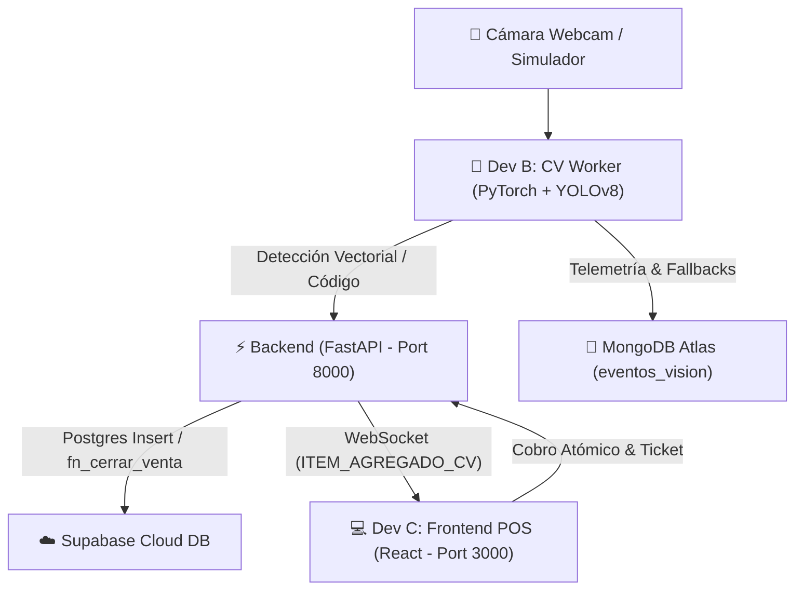

# 🛒 Sistema POS de Visión Computacional — Documentación Técnica

**Autor Principal**: Rivaldo  
**Proyecto**: Computer Vision Inventory Store  
**Módulos Desarrollados**: 
- **Dev B**: Computer Vision Worker (`cv-worker/`)
- **Dev C**: Frontend POS Cashier App (`frontend-pos/`)  
**Fecha de Entrega**: Septiembre 2026  
**Repositorio**: `RusselKu/Computer-Vision-Inventory-Store`

---

## 📌 1. Resumen Ejecutivo y Arquitectura del Sistema

El sistema implementa un Punto de Venta inteligente asistido por **Visión por Computadora e Inteligencia Artificial**. Permite identificar productos en tiempo real mediante imágenes (extracción de embeddings vectoriales con PyTorch y ResNet18) o lectura de códigos de barras (pyzbar + OpenCV), transmitiendo las detecciones al instante a una aplicación web de cajero a través de **WebSockets** y registrando las transacciones de inventario atómicamente en **Supabase PostgreSQL Cloud**.



---

## 🤖 2. Módulo Dev B: Computer Vision Worker (`cv-worker/`)

### 🧠 Arquitectura de IA y Modelos
1. **Reconocimiento Vectorial (ResNet18 Embeddings)** (`vector_engine.py`):
   - Emplea **ResNet18 pre-entrenado en PyTorch** recortando la última capa de clasificación para extraer vectores de características de **512 dimensiones**.
   - Normalización $L_2$ de los vectores para búsqueda ultrarrápida mediante **Similitud de Coseno** ($Sim(A,B) = \frac{A \cdot B}{\|A\| \|B\|}$).
   - Genera firmas vectoriales base para el catálogo de productos al arrancar el worker.
2. **Detección de Objetos (YOLOv8)** (`yolo_detector.py`):
   - Utiliza `ultralytics YOLOv8` para localizar objetos y extraer sus regiones de interés (*Bounding Boxes* $[x, y, w, h]$).
   - Incluye fallback de contornos morfológicos OpenCV en caso de bajo nivel de confianza.
3. **Lector de Códigos de Barras** (`barcode_reader.py`):
   - Decodificación primaria con `pyzbar` mejorada mediante ecualización de contraste adaptativo **CLAHE** y umbralización (*Otsu Thresholding*).
   - Fallback secundario a `cv2.barcode.BarcodeDetector`.
4. **Telemetría y Registro de Fallbacks** (`atlas_logger.py`):
   - Registro automático en **MongoDB Atlas** (`eventos_vision`) cuando se alcanzan frames no identificados, almacenando imágenes en Base64, coordenadas y metadatos para re-entrenamiento futuro.
   - Cuenta con soporte offline automático en consola local.

### ⚙️ Configuración y Controles de Teclado
- **Configuración** (`config.py`):
  - `FALLBACK_FRAME_THRESHOLD = 25` (Tolerancia de 25 frames sin reconocimiento antes de emitir alerta de fallback al POS, aproximadamente 2.0 segundos de escaneo continuo).
  - `COOL_DOWN_SECONDS = 2.0` (Evita registros duplicados de productos en intervalos menores a 2 segundos).

- **Teclas de Control en la Ventana de Transmisión (OpenCV HUD)**:
  - `[T]`: Alternar entre Cámara de Laptop en Vivo y Modo Simulación.
  - `[S]`: Simular lectura de Código de Barras (Sabritas / Doritos / Coca-Cola).
  - `[V]`: Simular lectura Vectorial por Visión (ResNet18 Embeddings).
  - `[F]`: Simular evento de Fallback (Alerta al Cajero).
  - `[C]`: Crear / Sincronizar nueva Venta Activa en el Backend.
  - `[Q]`: Cerrar Worker de Visión de forma segura.

---

## 💻 3. Módulo Dev C: Frontend POS Cashier App (`frontend-pos/`)

### 🎨 Diseño e Interfaz de Usuario
- Desarrollado en **React + Vite** con estilo moderno **Dark Mode** en tono esmeralda/azul noche (`index.css`).
- Iconografía enriquecida con `lucide-react`.

### ⚡ Características Clave
1. **Sincronización Automática con la Venta Activa**:
   - Al cargar la app, verifica en `GET /api/v1/ventas?estado=abierta&limit=1` si existe una venta abierta para adjuntarse automáticamente al mismo Folio que el CV Worker.
2. **Recepción por WebSockets en Tiempo Real**:
   - Conexión persistente a `ws://localhost:8000/api/v1/ws/pos/{venta_id}`.
   - Emisión de efectos de audio (*beeps* de escáner y tonos de alerta usando la API nativa de `AudioContext` de la Web API).
3. **Modal de Fallback / Atención Cajero**:
   - Se activa al recibir el evento `ALERTA_CV_FALLBACK`.
   - Incluye input directo para ingreso manual de código de barras.
   - **Botón "Cancelar / Regresar"**: Permite al cajero cerrar la ventana flotante en cualquier momento sin forzar la entrada manual.
4. **Modificación de Cantidades y Eliminación**:
   - Botones `+` / `-` para cambiar unidades de un producto en el carrito en tiempo real (`PATCH /api/v1/ventas/{id}/items/{item_id}`).
   - Eliminación de ítems por línea de producto (`DELETE /api/v1/ventas/{id}/items/{item_id}`).
5. **Cobro Atómico e Impresión de Ticket**:
   - Selección de método de pago (**Efectivo** / **Tarjeta**).
   - Invocación al endpoint de cierre `POST /api/v1/ventas/{id}/cerrar`.
   - Visualización de Comprobante / Ticket Digital con desglose de ítems, subtotal, total y Folio único.
   - Reinicio automático al presionar "Siguiente Venta".

---

## 🚀 4. Guía de Ejecución Local

### Paso 1: Iniciar el Backend (FastAPI + Supabase)
```bash
# Desde la raíz del proyecto
uvicorn app.main:app --app-dir backend --reload --port 8000
```
*API Swagger interactiva disponible en: `http://localhost:8000/docs`*

### Paso 2: Iniciar el Frontend POS (React)
```bash
# Desde la carpeta frontend-pos
cd frontend-pos
npm run dev
```
*Aplicación Web disponible en: `http://localhost:3000`*

### Paso 3: Iniciar el Worker de Visión Computacional
```bash
# Desde la raíz del proyecto
python cv-worker/main.py
```
*Presiona `T` dentro de la ventana de video para encender la webcam.*

---

## 🛡️ 5. Guía de Trabajo para Dev D, Dev E y Futuros Desarrolladores (Cómo No Dañar el Proyecto)

Para mantener la estabilidad del sistema y evitar conflictos en Git o fallos en producción, todos los desarrolladores deben acatar las siguientes directrices:

### 🔴 Regla 1: Aislamiento Estricto de Ramas (Git Isolation)
- **Dev D (Dashboard Admin)** debe trabajar **únicamente** en su propia rama dedicada: `feature/frontend-dashboard`.
- **NUNCA** hacer commits directos en la rama `main` o en ramas ajenas (`feature/cv-worker`, `feature/frontend-pos`).
- Para integrar cambios, se debe crear un **Pull Request (PR)** hacia `main` una vez probada la rama localmente.

### 🟡 Regla 2: Respetar la Estructura de Base de Datos y Stored Procedures en Supabase
- **NO modificar** los nombres ni tipos de datos de los campos en las tablas `ventas`, `detalle_ventas` y `productos`.
- La función en PostgreSQL `fn_cerrar_venta` realiza el descuento de inventario de forma **atómica**. Si Dev D necesita agregar reportes, debe realizar consultas de lectura (`SELECT`) y **nunca modificar la lógica de cierre de ventas**.

### 🟢 Regla 3: Consumo Estándar de la API REST y WebSockets
- Toda comunicación con el Backend debe realizarse utilizando los endpoints definidos en `/api/v1`:
  - `GET /api/v1/ventas`: Para consultar historial de ventas.
  - `GET /api/v1/productos`: Para ver estado actual del inventario.
  - `GET /api/v1/ventas/{id}`: Para ver detalle de una venta específica.
- No hacer consultas SQL directas desde el cliente web si ya existe un endpoint oficial provisto por el Backend.

### 🔵 Regla 4: Manejo de Variables de Entorno (`.env`)
- Nunca subir archivos `.env` con credenciales reales a GitHub.
- Si se agrega una nueva variable de entorno (ej. para un servicio de analíticas de Dev D), agregar su clave vacía o de ejemplo en `.env.example`.

---
*Documento preparado por **Rivaldo** — Proyecto POS Computer Vision 2026.*
