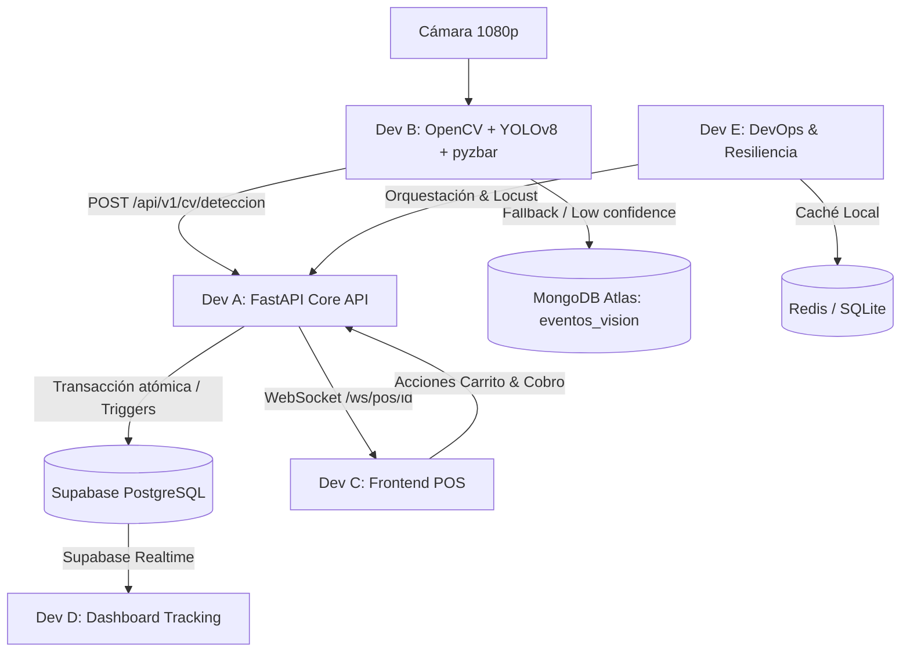

# Guía del Equipo — POS con Reconocimiento de Producto por Visión Computacional

> Dev E: consultar [DOCUMENTACION_DEV_E.md](DOCUMENTACION_DEV_E.md) para la cola
> persistente de cierres, el contrato HTTP 202, arranque y pruebas de carga/latencia.

Bienvenido al repositorio central de **Computer-Vision-Inventory-Store**. Este documento detalla la arquitectura implementada por **Dev A (Backend Core)** y establece los contratos, endpoints y pasos a seguir para el resto del equipo (**Dev B, Dev C, Dev D y Dev E**).

---

## 1. Lo que ha completado Dev A (Backend Core & Base de Datos)

### A. Base de Datos en Supabase (PostgreSQL)
- **Esquema Relacional:**
  - `productos`: Catálogo con identificadores EAN/UPC indexados, precios, categorías e imágenes.
  - `inventario`: Control de stock disponible, alertas de stock mínimo y ubicación física.
  - `ventas`: Encabezado transaccional con folio único (`VTA-YYYYMMDD-XXXX`), estados (`abierta`, `completada`, `cancelada`), subtotales y método de pago.
  - `detalle_ventas`: Líneas de venta con trazabilidad del origen (`cv_yolo`, `cv_barcode`, `manual`).
- **Lógica de Negocio en Base de Datos (Integridad y Alta Concurrencia):**
  - **Trigger `actualizar_totales_venta`:** Recalcula automáticamente en Postgres `subtotal` y `total` de la venta ante inserciones, actualizaciones o bajas en el detalle.
  - **Stored Procedure `fn_cerrar_venta`:** Cierre de venta transaccional atómico: bloquea filas con `FOR UPDATE`, valida que no haya rotura de stock, descuenta inventario en bloque y cambia el estado a `completada`. Si falta stock, aborta la operación de forma segura.
  - **Supabase Realtime:** Publicación activada para `inventario`, `ventas` y `detalle_ventas`.
  - **Seed Data:** 10 productos de retail estándar (refrescos, botanas, lácteos, panadería) precargados con códigos de barras comerciales y stock inicial.

### B. Microservicio FastAPI
- Arquitectura limpia y asíncrona estructurada en `backend/app/`.
- Validación estricta con Pydantic v2 y configuración mediante `pydantic-settings`.
- Endpoints transaccionales para el POS, endpoints para catálogo e inventario, endpoints para integración de visión y canal WebSocket para eventos en vivo.
- Documentación Swagger interactiva lista en `http://localhost:8000/docs`.

### C. Contenerización y Entorno
- `Dockerfile` optimizado para producción/desarrollo con Python 3.11.
- `docker-compose.yml` que orquesta la API FastAPI + Redis en red local compartida.
- `.env.example` versionado para facilitar el onboarding del equipo.

---

## 2. Guía y Tareas Pendientes para el Resto del Equipo



---

### Dev B — Visión por Computadora (CV Worker)

**Objetivo:** Capturar video en vivo, aislar el producto con YOLOv8 en GPU local, leer el código de barras con `pyzbar` y notificar al Backend.

#### Tareas a realizar:
1. **Captura y Preprocesamiento:**
   - Usar `cv2.VideoCapture` (cámara 1080p) con ajuste dinámico de contraste/brillo.
2. **Inferencia YOLOv8:**
   - Detectar la caja delimitadora (bounding box) del producto en el frame.
3. **Decodificación de Código de Barras (pyzbar):**
   - Recortar la región del bounding box y aplicar `pyzbar.decode()`.
4. **Contrato de Envío al Backend:**
   - Enviar cada detección exitosa a:
     `POST http://localhost:8000/api/v1/cv/deteccion`
     ```json
     {
       "venta_id": "UUID-DE-LA-VENTA-ACTIVA",
       "codigo_barras": "7501055312107",
       "clase_yolo": "coca_cola",
       "confianza": 0.95,
       "bounding_box": { "x": 120, "y": 80, "w": 250, "h": 400 },
       "es_fallback": false
     }
     ```
5. **Estrategia de Fallback:**
   - Si tras **5 frames consecutivos** el producto se detecta por YOLO pero `pyzbar` no logra leer el código de barras:
     1. Guardar el frame no reconocido en **MongoDB Atlas** (colección `eventos_vision`) para futuro re-entrenamiento.
     2. Enviar evento de fallback al backend con `"es_fallback": true` y `"mensaje_error": "Producto no reconocido tras 5 frames"`. El backend alertará instantáneamente a la pantalla del cajero (Dev C).

---

### Dev C — Frontend POS (Punto de Venta)

**Objetivo:** Interfaz de usuario para el cajero: panel de cámara, lista de productos en el carrito, totales en vivo y cobro.

#### Tareas a realizar:
1. **Iniciar Venta:**
   - Al abrir la pantalla o tras cada cobro, llamar a `POST /api/v1/ventas` para obtener un `id` y `folio` de venta nuevo.
2. **Conexión en Tiempo Real (WebSocket):**
   - Conectarse al WebSocket: `ws://localhost:8000/api/v1/ws/pos/{venta_id}`
   - Al escuchar eventos del tipo `ITEM_AGREGADO_CV`, agregar automáticamente la fila a la tabla del carrito con una pequeña animación de confirmación.
   - Al escuchar eventos del tipo `ALERTA_CV_FALLBACK`, mostrar un modal o aviso sonoro: *"Producto no reconocido. Ingrese el código manualmente"*.
3. **Operaciones Manuales del Carrito:**
   - Agregar manual: `POST /api/v1/ventas/{id}/items` con `{ "codigo_barras": "...", "cantidad": 1, "metodo_deteccion": "manual" }`.
   - Modificar cantidad: `PATCH /api/v1/ventas/{id}/items/{item_id}` con `{ "cantidad": 3 }`.
   - Eliminar item: `DELETE /api/v1/ventas/{id}/items/{item_id}`.
4. **Cierre de Venta (Cobro):**
   - Llamar a `POST /api/v1/ventas/{id}/cerrar` con `{ "metodo_pago": "efectivo" }` (o `tarjeta`).
   - Imprimir o mostrar ticket con el folio devuelto.

---

### Dev D — Frontend Dashboard & Tracking

**Objetivo:** Monitor en tiempo real para gerencia/almacén de stock, alertas de agotados y volumen de ventas.

#### Tareas a realizar:
1. **Suscripción en Tiempo Real con Supabase JS:**
   - Configurar `@supabase/supabase-js` con las credenciales de `.env`:
     ```javascript
     import { createClient } from '@supabase/supabase-js';
     const supabase = createClient(SUPABASE_URL, SUPABASE_ANON_KEY);

     // Escuchar descuentos de stock en vivo
     supabase
       .channel('inventario-en-vivo')
       .on('postgres_changes', { event: 'UPDATE', schema: 'public', table: 'inventario' }, payload => {
          console.log('Stock actualizado:', payload.new);
          // Actualizar métricas del dashboard sin recargar la página
       })
       .subscribe();
     ```
2. **Listado de Inventario y Alertas:**
   - Consumir `GET /api/v1/inventario?solo_bajo_stock=true` para mostrar semáforos de advertencia en productos críticos.
3. **Métricas de Ventas:**
   - Consumir `GET /api/v1/ventas?estado=completada` para graficar ventas del día y ticket promedio.

---

### Dev E — Integración, MongoDB Atlas & DevOps

**Objetivo:** Garantizar la infraestructura unificada, resiliencia offline y pruebas de rendimiento.

#### Tareas a realizar:
1. **Configurar MongoDB Atlas (Free Tier):**
   - Crear base de datos `pos_telemetria` y colecciones `logs_sistema` y `eventos_vision`.
   - Compartir el string de conexión `MONGODB_URI` con Dev B.
2. **Orquestación Local (Docker Compose):**
   - Ejecutar `docker-compose up -d` para verificar que la API y Redis levanten sin conflictos en cualquier máquina del equipo.
3. **Caché de Resiliencia (Día 4):**
   - Implementar un interceptor o cola local (SQLite / Redis): si la conexión a Supabase presenta latencia alta o desconexión temporal, encolar los tickets localmente y sincronizarlos cuando regrese el enlace.
4. **Pruebas de Carga y Latencia (Día 7):**
   - Configurar script de **Locust** simulando múltiples solicitudes concurrentes a `POST /api/v1/ventas/{id}/items` y `GET /api/v1/productos/codigo/{barcode}`.
   - Medir tiempo total de respuesta extremo a extremo: objetivo **<1.5 segundos** desde el frame de la cámara hasta la actualización en el ticket.

---

## 3. Cómo Levantar el Proyecto Localmente

### Opción A: Con Docker (Recomendada)
```bash
# 1. Asegurarse de tener el archivo .env configurado
cp .env.example .env

# 2. Levantar la API y Redis
docker-compose up --build

# La API estará disponible en http://localhost:8000
# Documentación Swagger en http://localhost:8000/docs
```

### Opción B: Entorno Local de Python
```bash
# 1. Crear y activar entorno virtual
python -m venv .venv
.\.venv\Scripts\activate       # Windows PowerShell
# source .venv/bin/activate    # Linux / macOS

# 2. Instalar dependencias
pip install -r requirements.txt

# 3. Iniciar el servidor de desarrollo
uvicorn app.main:app --app-dir backend --reload --host 0.0.0.0 --port 8000
```

### Integración Continua (GitHub Actions)
El repositorio cuenta con un pipeline automatizado en `.github/workflows/ci.yml` que:
- Valida la sintaxis del `docker-compose.yml`.
- Instala dependencias y corre la suite de pruebas `pytest` ante cada Push o Pull Request a `main`, `master` o `develop`.
- Construye la imagen Docker del backend para asegurar que no existan regresiones de compilación.


---

## 4. Catálogo Inicial para Pruebas (Seed Data)

Puedes probar inmediatamente con cualquiera de estos códigos de barras comerciales precargados en Supabase:

| Código de Barras | Nombre del Producto | Precio | Stock Inicial | Categoría |
|---|---|---|---|---|
| `7501055312107` | Coca-Cola Original 600ml | $18.00 | 50 | Bebidas |
| `7501000111203` | Sabritas Sal 45g | $22.00 | 50 | Snacks |
| `7501000153036` | Doritos Nacho 58g | $21.00 | 50 | Snacks |
| `7501011115481` | Galletas Chokis 76g | $19.50 | 50 | Galletas |
| `7501020512110` | Agua Ciel Purificada 1L | $12.00 | 50 | Bebidas |
| `7501008044237` | Leche Lala Entera 1L | $28.50 | 50 | Lácteos |
| `7501000122209` | Ruffles Queso 50g | $23.00 | 50 | Snacks |
| `7501031311309` | Emperador Chocolate 101g | $20.00 | 50 | Galletas |
| `7501017005083` | Jugo Del Valle Manzana 413ml | $17.00 | 50 | Bebidas |
| `7501025401129` | Pan Bimbo Blanco Grande 680g | $46.00 | 50 | Panadería |
